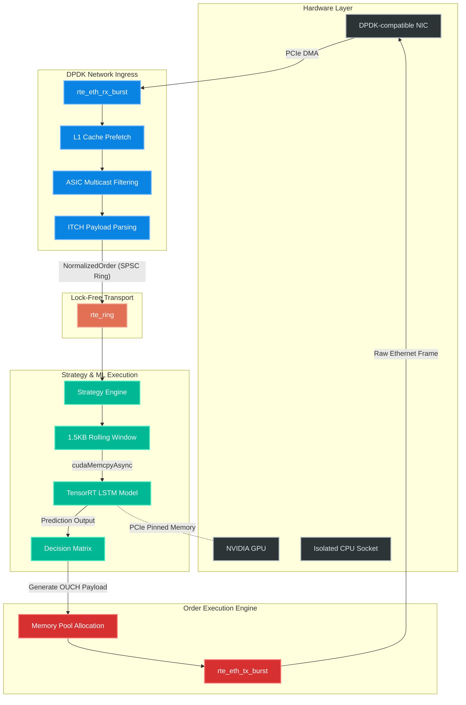

# Architecture: Ultra-Low Latency High-Frequency Trading Engine

This document provides a deep dive into the hardware-aware software architecture of the HFT Engine. By combining DPDK for kernel bypass and TensorRT for optimized AI execution, this system achieves deterministic sub-microsecond tick-to-trade latencies.

## High-Level Data Flow

## Architectural Pillars

### 1. Kernel Bypass with DPDK
Traditional networking stacks in Linux introduce heavy latency due to context switching, IRQ handling, and multiple buffer copies. 
- **Zero-Copy DMA:** Incoming packets are directly DMA'd (Direct Memory Access) from the NIC into userspace `rte_mbuf` structures.
- **Polling over Interrupts:** The CPU core is 100% dedicated to a tight `while` loop continuously polling `rte_eth_rx_burst`.

### 2. Lock-Free Single-Producer Single-Consumer (SPSC) Queues
Mutexes and locks cause disastrous latency spikes. Thread handoff is accomplished using DPDK's `rte_ring`.
- **Cache-Line Aligned:** The rings are perfectly padded to prevent false sharing between L1 caches of different cores.
- **Pass by Value:** Lightweight `NormalizedOrder` structs are copied directly into the ring buffer, preventing complex memory lifetime issues and pointer chasing.

### 3. GPU/CPU PCIe Symbiosis
To prevent the GPU from blocking the critical path:
- **Pinned Host Memory:** We use `cudaHostAlloc` to allocate memory that is permanently mapped into both the CPU and GPU virtual address spaces.
- **Asynchronous Execution:** Inference is launched on a dedicated `cudaStream_t`. The CPU is immediately freed to process the next incoming market tick while the GPU crunches the numbers.

### 4. Hardware/ASIC Offloading
- **RTE Flow Filtering:** Extraneous market data is discarded at the hardware level using the NIC's ASIC before it ever traverses the PCIe bus to reach the CPU.

### 5. Deterministic Memory Management
- **No `malloc` or `new`:** All memory is pre-allocated at startup in `rte_mempool` structures. 
- During runtime, generating an order requires popping a pre-sized buffer from the pool, filling it, and blasting it out via `rte_eth_tx_burst`.
