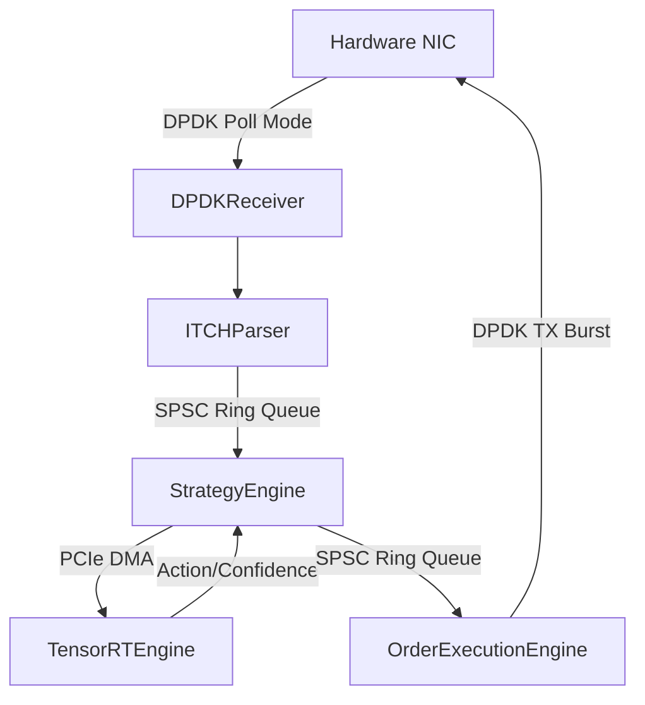

# Component Breakdown

The `HFT` (High-Frequency Trading) system is split into modular C++ components, each rigorously optimized for cache locality and strict single-responsibility principles.

## Core Files

## Core Components

### 1. `ITCHParser` (`itch_parser.h / .cpp`)
- **Role:** Pure business logic layer responsible for decoding raw NASDAQ ITCH 5.0 payloads.
- **Key Features:** Endianness conversion (`rte_be_to_cpu_64`), bit-shifting for 6-byte timestamps, and strict bounds-checking.
- **Testing:** 100% decoupled from hardware I/O, allowing extensive unit testing via Google Test (`tests/test_itch_parser.cpp`).

### 2. `DPDKReceiver` (`network_ingress.h / .cpp`)
The "Ears" of the trading system.
- **Responsibilities:**
  - Manages the DPDK `rte_eth_rx_burst` polling loop.
  - Implements Hardware RTE Flow filtering (e.g., matching UDP Multicast data).
  - Employs L1 Cache prefetching (`rte_prefetch0`) to hide RAM latency.

### `main.cpp`
The entry point and orchestration layer.
- **Responsibilities:**
  - Initializes the DPDK Environment Abstraction Layer (`rte_eal_init`).
  - Discovers and pins threads to isolated Logical Cores (lcores) on specific NUMA sockets.
  - Instantiates the Ring Buffers and triggers `rte_eal_remote_launch` for the worker threads.
  - Handles POSIX signals for graceful `SIGINT` shutdowns.

  - Normalizes market data and enqueues it to the SPSC ring.

### `strategy_engine.cpp` & `strategy_engine.h`
The "Brain" of the trading system.
- **Responsibilities:**
  - Constantly dequeues normalized ticks from the SPSC ring.
  - Maintains a dense 1.5KB rolling window (e.g., L2 order book representation).
  - Interfaces tightly with the `tensorrt_engine` to execute asynchronous predictions.
  - Evaluates prediction outputs against risk thresholds to generate actionable trading signals.

### `tensorrt_engine.cpp` & `tensorrt_engine.h`
The GPU Acceleration layer.
- **Responsibilities:**
  - Deserializes highly optimized FP16 TensorRT `.engine` models.
  - Allocates pinned host memory using `cudaHostAllocMapped` for zero-copy PCIe streaming.
  - Manages asynchronous inference via CUDA streams and events (`cudaMemcpyAsync`, `cudaStreamSynchronize`).

### `order_execution.cpp` & `order_execution.h`
The "Hands" of the trading system.
- **Responsibilities:**
  - Bypasses traditional socket programming to format raw outbound Ethernet frames.
  - Constructs NASDAQ OUCH or similar binary execution payloads directly in DPDK `rte_mbuf` structs.
  - Performs final fat-finger risk checks (e.g., maximum lot sizes).
  - Blasts packets onto the wire via `rte_eth_tx_burst`.

### `telemetry.cpp` & `telemetry.h`
The Observability layer.
- **Responsibilities:**
  - Runs entirely out of the hot-path on a separate thread.
  - Collects nanosecond TSC (`rte_rdtsc`) timestamps from ingress to egress.
  - Generates percentiles (p50, p90, p99) for continuous latency monitoring and offline profiling.

### `export_model.py`
The Model Converter.
- **Responsibilities:**
  - Converts standard PyTorch (`.pt` or `.pth`) state dictionaries into optimized ONNX.
  - Further compiles ONNX into a highly-optimized NVIDIA TensorRT engine customized for the target GPU architecture.
