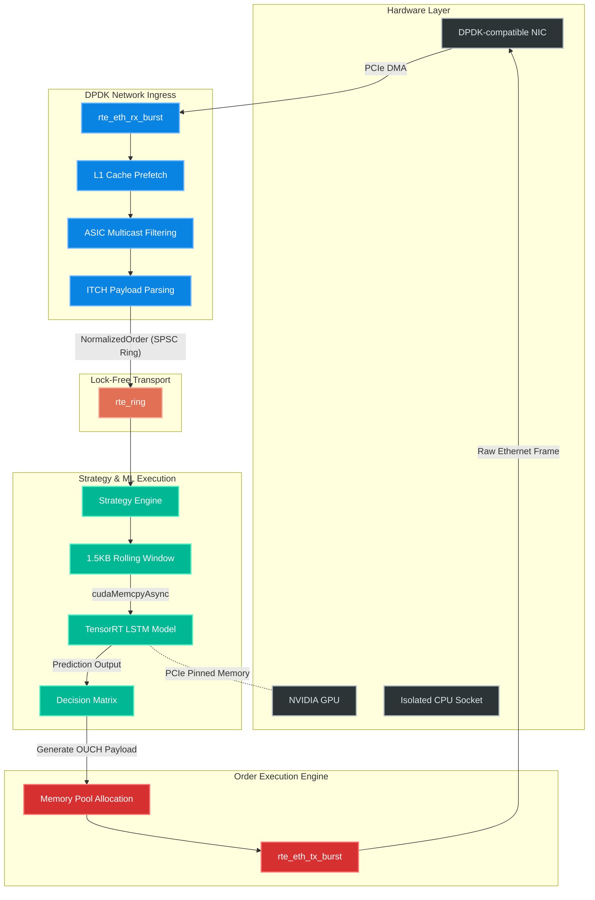

# Ultra-Low Latency High-Frequency Trading (HFT) Engine


A state-of-the-art, kernel-bypassing, C++20 High-Frequency Trading engine designed for sub-microsecond tick-to-trade latency. This project implements a fully asynchronous pipeline using **DPDK** for zero-copy network ingress/egress and **TensorRT** for GPU-accelerated deep learning execution over pinned PCIe memory.

## 🚀 Key Features

- **Kernel Bypass (DPDK):** Eliminates Linux TCP/IP stack overhead by directly polling the NIC via `rte_eth_rx_burst`.
- **Zero-Copy GPU Inference:** Uses `cudaHostAllocMapped` to stream market data natively over PCIe to the GPU without CPU blocking or memory fragmentation.
- **Hardware Symbiosis:**
  - **NUMA-Aware Allocations:** Binds all `rte_mempool` and `rte_ring` structures directly to the NIC's CPU socket, preventing cross-QPI latency penalties.
  - **L1 Cache Prefetching:** Utilizes `rte_prefetch0()` to hide RAM latency.
  - **ASIC RTE Flow Filtering:** Offloads UDP/Multicast protocol filtering directly to the hardware NIC ASIC.
- **Lock-Free Thread Handoff:** SPSC (Single-Producer, Single-Consumer) `rte_ring` queues for zero-lock data transit between isolated logical cores.
- **Microsecond-Scale Telemetry:** Lock-free, non-blocking Time Stamp Counter (`rte_rdtsc()`) tracking aggregated into background percentile histograms (p50, p90, p99).
- **PCAP Simulation Engine:** Offline backtesting capability that directly mounts `.pcap` files into the DPDK loop using `net_pcap`.

---

## 🎯 Project Context & Learning Journey
- **Timeline:** 2.5 Months (Developed iteratively alongside advanced Coursera specializations)
- **Purpose:** A rigorous portfolio project designed to demonstrate practical expertise in modern low-latency systems, kernel bypass networking, and hardware-accelerated machine learning.
- **AI Assistance:** Developed with the assistance of AI coding assistants for boilerplate generation, initial CMake configuration, and documentation formatting. The core architecture decisions, C++ memory management, and system integration were driven by deep self-directed research.
- **Key Technical Insights Gained:**
  1. **Kernel Bypass Mechanics:** Moving past the Linux TCP/IP stack to understand polling vs. interrupts and managing raw `rte_mbuf` memory pools.
  2. **NUMA Architecture:** The critical importance of pinning threads and memory pools to the exact CPU socket physically wired to the NIC to avoid QPI/UPI cross-talk.
  3. **Lock-Free Concurrency:** Designing strict Single-Producer, Single-Consumer (SPSC) ring buffers to pass market data between isolated cores without disastrous mutex contention.
  4. **GPU PCIe Bottlenecks:** Discovering that while DPDK operates in nanoseconds, transferring data to a GPU via PCIe and executing TensorRT kernels intrinsically shifts the latency floor to the microsecond scale.
  5. **Hardware Offloading:** Utilizing ASIC-level RTE Flow rules to drop/filter UDP multicast packets before they ever cross the PCIe bus to the CPU.

---

## 🏗️ System Architecture



1. **Network Ingress (`DPDKReceiver`)**: Pinned to an isolated lcore. Casts raw network packets directly into highly-packed `ITCH_AddOrder` structs.
2. **Strategy Engine (`StrategyEngine`)**: Maintains a 1.5KB rolling window (1x64x6 ticks) and executes asynchronous AI predictions using custom `cudaStream_t` and `cudaEvent_t`.
3. **Execution Engine (`OrderExecutionEngine`)**: Instantly blasts outbound `OUCH_EnterOrder` payloads directly from pre-allocated DPDK memory pools using `rte_eth_tx_burst`.
4. **Telemetry Engine**: Background thread responsible for aggregating metrics safely out of the hot path.

---

## 🛠️ Prerequisites

To deploy and execute this system, you must have a dedicated Linux server equipped with:
- **OS:** Ubuntu 20.04/22.04 (or similar Linux distribution)
- **Networking:** DPDK-compatible Network Interface Card (NIC) bound to `vfio-pci` or `igb_uio`.
- **GPU:** NVIDIA GPU with Turing/Ampere/Hopper architecture.
- **Libraries:**
  - `libdpdk-dev` (Data Plane Development Kit)
  - CUDA Toolkit (11.x or 12.x)
  - NVIDIA TensorRT (8.x)
  - `cmake` (>= 3.18)
  - `python3`, `torch`, `tensorrt` (for model export)

---

## ⚙️ Installation & Build Instructions

### 1. Allocate Kernel Hugepages
DPDK requires pre-allocated contiguous memory to function:
```bash
sudo sysctl -w vm.nr_hugepages=1024
```

### 2. Export the TensorRT AI Engine
Generate the highly optimized FP16 TensorRT inference engine:
```bash
python3 export_model.py
```
*Ensure `lstm_model.engine` is generated successfully in your working directory.*

### 3. Compile the C++ Engine
```bash
mkdir -p build && cd build
cmake ..
make -j$(nproc)
```

---

## 🧪 Testing & QA (Google Test)

Given the hardware-specific nature of DPDK and TensorRT (requiring bare-metal PCIe access), the core business logic is heavily decoupled from the hardware I/O for unit testing. The pure algorithmic logic (such as the NASDAQ ITCH protocol parsing and endianness translation) is fully covered by Google Test (`gtest`).

To run the unit tests:
```bash
mkdir build && cd build
cmake ..
make hft_tests
./hft_tests
```

**Test Coverage Highlights:**
- Byte-level bounds checking to prevent segfaults on malformed network packets.
- Endianness translation (`rte_be_to_cpu_64`) for network-to-host conversions.
- Protocol assertion (ignoring non-'A' type ITCH packets).

---

## 🚦 Execution

### PCAP Replay Mode (Simulation & Backtesting)
Run the application completely offline against historical market micro-bursts to validate your AI model's Profit and Loss (PnL).
```bash
sudo ./hft_main --pcap /path/to/test_market_data.pcap
```
*Note: In PCAP mode, execution payloads are securely buffered and dumped to `trades_ledger.csv` upon shutdown.*

### Live Production Mode
Connect the engine directly to the physical NIC for live trading.
```bash
sudo ./hft_main
```

---

## 🛑 Graceful Shutdown & Telemetry
Issue a `SIGINT` (`Ctrl+C`) to gracefully halt the pipeline. 
The system will safely flush the execution ledger and print the final latency analysis:
```text
========================================
        HFT TELEMETRY REPORT
========================================
Total Orders Fired : 84210
p50 Latency (ns)   : 12500 ns
p90 Latency (ns)   : 16200 ns
p99 Latency (ns)   : 24500 ns
========================================
```

> [!NOTE]
> **Latency Physics:** Achieving sub-microsecond latency (< 1000ns) is typically reserved for FPGA/ASIC hardware. In this hybrid architecture, while the DPDK network ingress and egress process in under 300ns, the total tick-to-trade latency is fundamentally bound by the PCIe bus physics. The round-trip DMA transfer (`cudaHostAllocMapped`) and TensorRT GPU kernel execution add ~10-20µs of overhead. The system aims for microsecond-scale determinism with minimal jitter, rather than nanosecond latency.

---

## ⚠️ Pre-Trade Risk Control
This system operates at speeds that bypass human intervention. Hardcoded risk constraints (Fat-Finger Kill Switches) are built natively into `order_execution.h`. By default, orders exceeding `10,000` shares or containing invalid price bounds are aggressively dropped in userspace before hardware transmission.
